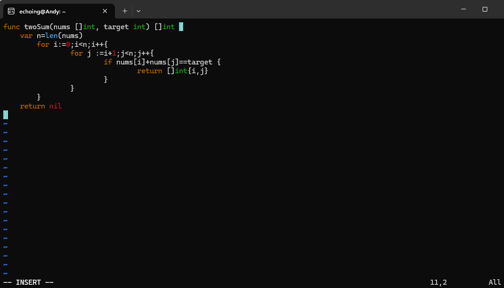
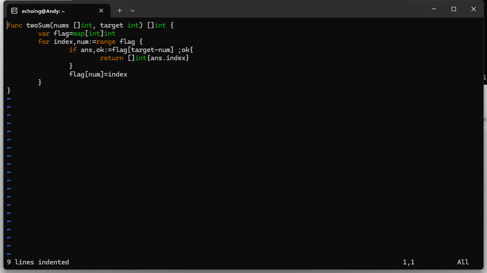

# 1.两数之和-题解

## 1.暴力求解

​	for i 循环遍历所有元素，再用一个for循环遍历j : i+1->n `n=len(nums)`

​	判断i,j是否符合要求`nums[i]+nums[j]==target`

​	时间复杂度O( $N^2$）

```go
func twoSum(nums []int, target int) []int {
    var n=len(nums)
	for i:=0;i<n;i++{
		for j :=i+1;j<n;j++{
			if nums[i]+nums[j]==target {
				return []int{i,j}
			}
		}
	}
    return nil
}
```

	       	  

## 2.hash表优化

​	遍历nums中的每一个元素，读取出num，并在hash中查找是否存在target-num。有则输出。正常将这个元素读入hash`flag[num]=index`

​	由于hash表的不确定，效率也在O($N$)~O($N^2$)之间，题目数据比较简单且不易重复，复杂度大概为O($N$)

```go
func twoSum(nums []int, target int) []int {
    flag:=map[int]int{}
	for index,num:=range nums {
		if ans,ok:=flag[target-num] ;ok{
			return []int{ans,index}
		}
		flag[num]=index
	}
    return nil
}
```



## 3.排序，加二分查找优化

​	将定义结构体，存储num和index。

​	对nums按num大小排序。`可以用快排、归并排序` 但是快排也有不确定性。

​	遍历nums，用二分查找target-num

​	如果符合条件且`a.index!=b.index`

​	则比较index大小输出。

​	复杂度为O(n log n)

​	<!--代码太长，不想写了，不过二分查找和排序应该可以用函数-->

